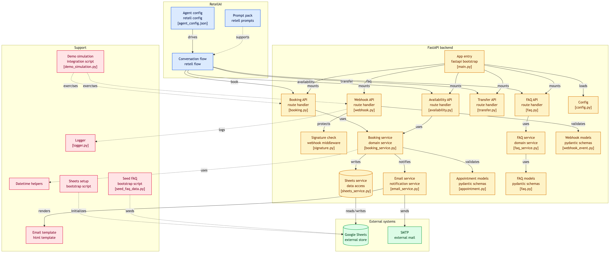

# 🦷 QuensultingAI Dental Clinic — AI Voice Agent

> **Production-ready AI receptionist** that handles inbound calls, books appointments, answers FAQs, and transfers to humans when needed.

Built with **RetellAI** (Conversational AI) + **FastAPI** (Python Backend) + **Google Sheets** (Data Layer) + **SMTP** (Email Confirmations).

---

## 🎯 Features

| Feature | Description |
|---|---|
| 📞 **Natural Call Handling** | Warm, professional voice receptionist ("Lisa") handles inbound calls |
| 📅 **Appointment Booking** | Full booking flow: service → name → phone → email → date/time → confirmation |
| ❓ **FAQ Answering** | Keyword-matched answers from a Google Sheets knowledge base |
| 🔄 **Interruption Handling** | Callers can interrupt mid-sentence with natural barge-in |
| 🛡️ **Fallback Conversations** | Escalating clarification: rephrase → offer options → transfer to human |
| 👤 **Customer Data Collection** | Extracts name, phone, email with read-back confirmation |
| 📲 **Human Transfer** | Seamless call transfer to front desk when needed |
| 📧 **Confirmation Email** | Professional HTML email sent automatically after booking |
| 🔐 **Webhook Security** | HMAC-SHA256 signature verification on all Retell webhooks |
| 📊 **Call Logging** | Every call logged to Google Sheets with outcome, sentiment, and summary |

---

## 🏗️ Architecture



---

## 📁 Project Structure

```
AI-Voice-Agent/
├── app/                        # FastAPI application
│   ├── main.py                 # App entrypoint, routes, CORS
│   ├── config.py               # Environment config (pydantic-settings)
│   ├── api/                    # API route handlers
│   │   ├── webhook.py          # Retell webhook receiver
│   │   ├── booking.py          # Book appointment endpoint
│   │   ├── availability.py     # Check slots endpoint
│   │   ├── faq.py              # FAQ lookup endpoint
│   │   └── transfer.py         # Human transfer endpoint
│   ├── services/               # Business logic
│   │   ├── sheets_service.py   # Google Sheets CRUD
│   │   ├── booking_service.py  # Booking validation & creation
│   │   ├── faq_service.py      # Keyword-based FAQ matching
│   │   └── email_service.py    # Async SMTP email sender
│   ├── models/                 # Pydantic schemas
│   │   ├── appointment.py      # Booking request/response models
│   │   ├── webhook_event.py    # Retell webhook payloads
│   │   └── faq.py              # FAQ request/response models
│   ├── middleware/
│   │   └── signature.py        # HMAC-SHA256 webhook verification
│   └── utils/
│       ├── datetime_helpers.py # Slot generation, date parsing
│       └── logger.py           # Structured logging
├── retell/                     # RetellAI assets
│   ├── conversation_flow.json  # Complete conversation flow (20 nodes)
│   ├── agent_config.json       # Agent settings (voice, model, etc.)
│   └── prompts/                # Prompt fragments
├── templates/
│   └── confirmation_email.html # HTML email template
├── scripts/
│   ├── setup_google_sheets.py  # Initialize sheet structure
│   └── seed_faq_data.py        # Populate FAQ entries
├── tests/                      # Test suite
├── docs/                       # Setup & deployment guides
├── requirements.txt
├── Makefile
├── .env.example
└── .gitignore
```

---

## 🚀 Quick Start

### 1. Clone & Install

```bash
git clone https://github.com/your-username/AI-Voice-Agent.git
cd AI-Voice-Agent
python -m venv venv
source venv/bin/activate
pip install -r requirements.txt
```

### 2. Configure Environment

```bash
cp .env.example .env
# Edit .env with your actual credentials
```

Required credentials:
- **RetellAI**: API key, Agent ID, Webhook Secret
- **Google Sheets**: Service account JSON, Spreadsheet ID
- **SMTP**: Gmail address + App Password

### 3. Set Up Google Sheets

Follow the [Google Sheets Setup Guide](docs/google_sheets_setup.md), then:

```bash
python scripts/setup_google_sheets.py   # Create sheet tabs + headers
python scripts/seed_faq_data.py          # Populate FAQ data
```

### 4. Set Up RetellAI

Follow the [RetellAI Setup Guide](docs/retell_setup_guide.md) to:
- Create a Conversation Flow agent
- Configure Function Nodes pointing to your backend
- Set up webhooks and post-call analysis

### 5. Run the Server

```bash
make dev    # Development with auto-reload
# or
make run    # Production mode
```

The API will be available at `http://localhost:8000`
- Swagger docs: `http://localhost:8000/docs`
- Health check: `http://localhost:8000/health`

### 6. Run Tests

```bash
make test
```

### 7. Run Interactive Demo Simulation

You can test the entire backend data flow (FAQ matching, slot availability, booking insertion, Google Sheets logging, and email triggers) locally without placing an actual call:

```bash
make demo
```

This simulates the conversational engine calling your API endpoints sequentially and displays detailed console feedback.

---

## 📡 API Endpoints

| Method | Endpoint | Purpose |
|---|---|---|
| `POST` | `/webhook` | Receive Retell post-call events |
| `POST` | `/book-appointment` | Book appointment (Function Node) |
| `POST` | `/check-availability` | Check open slots (Function Node) |
| `POST` | `/check-faq` | FAQ lookup (Function Node) |
| `POST` | `/transfer-call` | Initiate human transfer (Function Node) |
| `GET` | `/health` | Health check |
| `GET` | `/` | Root / API info |

---

## 🗣️ Conversation Flow

The agent follows a **20-node state machine**:

```
Greeting → Intent Detection → ┬─ Booking Flow (6 steps) → Confirmation
                               ├─ FAQ Flow → Answer Delivery
                               ├─ Human Transfer
                               └─ Fallback (2 retries) → Transfer
```

### Booking Flow
1. Collect service type
2. Collect name (with read-back)
3. Collect phone (with digit-by-digit confirmation)
4. Collect email (with spell-back)
5. Check availability → suggest slots
6. Confirm and book → send email

---

## 🏥 Clinic Configuration

| Detail | Value |
|---|---|
| **Services** | Dental Cleaning, Root Canal Treatment, Teeth Whitening, Braces Consultation, Tooth Extraction, General Dental Consultation |
| **Hours** | Monday–Saturday, 9 AM – 6 PM |
| **Slot Duration** | 30 minutes |
| **Agent Name** | Lisa |
| **Max Call Duration** | 10 minutes |

---

## 📋 Reasonable Assumptions

To implement a clean, reliable, and functional MVP, the following assumptions were made during development:

1. **Consultation Fee**: A standard consultation fee of **₹500** is assumed for all general patient visits. This fee is explicitly communicated during FAQ lookups but is not charged programmatically.
2. **Appointment Slotting**: Slots are strictly divided into **30-minute intervals** starting on the hour and half-hour. Only one patient can book a specific slot at a time.
3. **Weekly Timings & Sunday Closing**: The clinic operates strictly **Monday through Saturday from 9:00 AM to 6:00 PM**, with Sunday being a non-working day. Bookings requested for Sundays are automatically redirected by the system.
4. **Walk-ins Handling**: The clinic accepts walk-ins based on availability, but the voice assistant instructs walk-in callers that wait times can vary and highly recommends booking an appointment.
5. **Emergency Escalations**: Real-time dental emergencies (e.g., severe hemorrhage, acute trauma) are treated as high priority and immediately routed to a human receptionist via the `POST /transfer-call` action.
6. **Payment Methods**: Accepted payment types include Cash, Major Debit/Credit Cards (Visa, MasterCard, Amex), UPI/Mobile apps, and select Dental Insurances.
7. **Pediatric Care**: The clinic accepts children of all ages. Parents are advised that their child's first dental checkup should occur by their first birthday.

---

## 🛠️ Design Decisions

The architectural and technical choices made throughout this project are backed by practical engineering rationales:

- **FastAPI Framework**: Chosen for its fast execution speed (built on Starlette/Uvicorn), automatic OpenAPI documentation (`/docs`), native async support, and rapid request validation via Pydantic.
- **Google Sheets as Data Store**: Google Sheets was chosen to fulfill the direct project criteria. It serves as a zero-cost, lightweight database that allows non-technical clinic administrators to easily read, manage, and edit appointment logs directly.
- **RetellAI Conversational Flow**: Retell's deterministic state-machine was chosen over direct custom LLM prompt instructions. In a clinical booking scenario, deterministic state flows prevent LLM hallucinations, ensuring names, phone numbers, and booked dates are verified, structured, and double-checked before writing to Sheets.
- **Service Layer Architecture**: The project separates route handling (`api/`) from business logic (`services/`) and models (`models/`). This separation of concerns allows unit testing the business logic (e.g., duplicate checking, date parsing) without launching the FastAPI web server.
- **Pydantic Validation**: Used to validate both incoming webhooks and Function Node parameters, enforcing runtime safety and type-coercion.
- **Async Emails (`BackgroundTasks`)**: Email notifications are sent out-of-band using FastAPI's built-in `BackgroundTasks` queue. This guarantees that SMTP server latency (which can take 2–5 seconds) does not delay the Retell Function Node response (which requires a <10s response time).
- **HMAC Webhook Verification**: To secure backend routes from unauthorized writes, all incoming webhooks are validated using an HMAC-SHA256 signature in the request headers compared with a local secret.

---

## 🧠 Challenges Faced

During development and code review, several key real-world engineering challenges were addressed:

1. **Natural Voice Conversations & Dynamic Interruptions**: Building an agent that doesn't talk over the user or cut them off required careful configuration of Retell's `responsiveness` (0.7) and `interruption_sensitivity` (0.7). Additionally, backchannel comments were disabled during data collection steps to prevent digit misrecognition.
2. **Duplicate Booking Prevention**: If a user double-clicks or makes multiple call bookings, writing duplicate entries to a Google Sheet can occur. A service-layer validation step was implemented to query confirmed appointments on the date and block duplicate email/phone records for the same service.
3. **Google Sheets as a Database**: Google Sheets has strict API rate limits and lacks ACID transactions/locking. To mitigate rate limits, FAQ entries are cached locally. The system is designed with simple read-before-write validation to minimize sheet access.
4. **Spoken Date & Time Parsing**: Callers speak dates in many formats ("next Friday", "July fifth", "10 in the morning"). A flexible multi-format parser was built to successfully map standard strings to actual `datetime.date` and `datetime.time` objects.
5. **Call Duration Balancing**: To keep calls short, direct, and cost-effective, prompt specifications instruct the agent to remain brief, speak no more than 1–2 sentences at a time, and list at most 5 available slots.

---

## 🔮 Future Improvements

- [ ] **Two-Way Google Calendar Sync**: Real-time bidirectional synchronization with the dentists' active Google Calendars.
- [ ] **Twilio SMS Alerts**: Send automated text reminders to patient phones 24 hours before the appointment.
- [ ] **WhatsApp Confirmations**: Integrate WhatsApp Business API to deliver digital appointment confirmation cards.
- [ ] **Multi-language Voice Support**: Enable automated bilingual greetings and flows (English/Spanish).
- [ ] **Voice Sentiment Analysis**: Track caller sentiment metrics (positive/negative/neutral) inside the call history database.
- [ ] **Self-Service Rescheduling**: Allow callers to reschedule or cancel existing bookings via voice by verifying their phone number.
- [ ] **Clinic Dashboard & Analytics**: A Next.js-based analytics dashboard showing total appointments, busy slots, and drop-off points.

---

## 🛡️ Security

- **Webhook Signature Verification**: All Retell webhooks verified via HMAC-SHA256
- **Idempotent Webhook Processing**: Duplicate events are detected and skipped
- **Credentials Protection**: Service account keys and secrets excluded from Git
- **API Docs Disabled in Production**: Swagger/ReDoc hidden when `APP_ENV=production`

---

## 📚 Documentation

| Guide | Description |
|---|---|
| [RetellAI Setup](docs/retell_setup_guide.md) | Agent creation, flow config, phone provisioning |
| [Google Sheets Setup](docs/google_sheets_setup.md) | GCP project, service account, sheet structure |
| [Deployment Guide](docs/deployment_guide.md) | Railway, Render, and Cloud Run deployment |

---

## 📦 Deployment Instructions

Detailed steps are provided in the [Deployment Guide](docs/deployment_guide.md). The production deployment steps are summarized below:

### Production Env Variables
```env
APP_ENV=production
APP_HOST=0.0.0.0
APP_PORT=8000
RETELL_API_KEY=your-key
RETELL_AGENT_ID=your-agent-id
RETELL_WEBHOOK_SECRET=your-secret
GOOGLE_SHEETS_SPREADSHEET_ID=your-sheet-id
SMTP_HOST=smtp.sendgrid.net
SMTP_PORT=587
SMTP_USERNAME=apikey
SMTP_PASSWORD=your-sendgrid-key
EMAIL_FROM_ADDRESS=appointments@quensultingai.com
```

### Production Checklist
1. Ensure `APP_ENV` is set to `production` (disables raw docs endpoints).
2. Set up SSL (HTTPS is required for Retell webhooks).
3. Encode your GCP `service_account.json` into environment variables (or use base64 decoding on platforms like Railway).

---

## 🧪 Testing

```bash
make test           # Run all tests
make test-cov       # Run with coverage report
make lint           # Lint with ruff
make format         # Auto-format code
```

Tests cover:
- All API endpoints (webhook, booking, availability, FAQ)
- Booking service validation (service types, dates, times, conflicts)
- FAQ keyword matching and threshold behavior
- Datetime helper utilities

---

## 🛠️ Tech Stack

| Component | Technology |
|---|---|
| Voice AI | RetellAI (Conversation Flow) |
| Backend | Python 3.11+ / FastAPI |
| Data Layer | Google Sheets (gspread) |
| Email | aiosmtplib + Jinja2 templates |
| Validation | Pydantic v2 |
| Testing | pytest |
| Linting | ruff |

---

## 📄 License

Built as an internship assignment for QuensultingAI.

---

<p align="center">
  Built with ❤️ by Karan Thakur
</p>